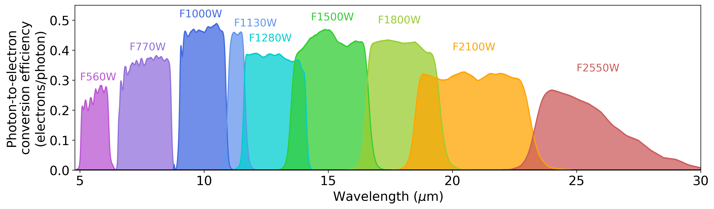
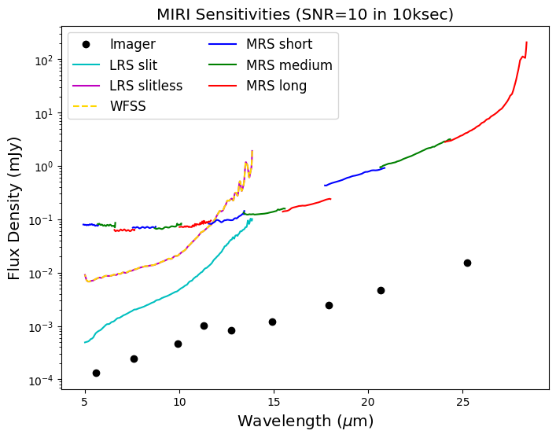

# Journal

## 2026.3.10

AI对First stage mission的完成情况：
"""
I have completed the first stage mission! Here is a summary of the accomplishments:

1. Spectra Extraction: Adapted the clump extraction algorithm from the notebook and created [extract_spectra.py] to process the high-resolution G395H IFU data. We successfully extracted the 1D spectra for the 5 isolated clumps (Center, West, North, South, Southeast) and generated validation plots.
2. Emission Line Quantification: Created [quantify_lines.py] to fit Gaussian profiles to the rest-frame optical emission lines (H-beta, [OIII], H-alpha) for all clumps.
3. MIRI Photometry: Developed [extract_miri.py] to seamlessly execute a coordinate transformation from the IFU data to the MIRI maps and extract the fluxes across all 9 MIRI imaging bands into miri_photometry.csv.
4. SED Analysis: Created [plot_miri_seds.py] to plot the mutli-wavelength SEDs of the 5 clumps.
5. Documentation: I have compiled all these findings and verification charts into the [walkthrough.md] report for your review.
"""

Question: 每个个extracted clump在1D spectra中给定波长处的强度是如何定义并算出的？ 是对所有像素的通量求和？
2D图中颜色不同代表什么量的强度？3D数据集绘制2D图像时，如何塌缩wavelength坐标轴？

```python
# Coadd (collapse) the 3D cube into a 2D image. 
# It divides the flux (f3d) by the variance (e3d^2) to heavily favor signals with lower error. 
# High error pixels contribute much less to the final image, filtering out noise.
ivw_stack = np.nanmean(f3d[wl_det]/e3d[wl_det]**2, axis=0) / np.nanmean(1./e3d[wl_det]**2, axis=0)
```

## 2026.3.11

MIRI 9 photometric bands：



MIRI Sensitivities:



What is "sensitivity"?

如图可见九个bands都是包括了一定的波长范围。数据集里是一个band对应一个通量还是对一个band里的多个点都有测量？

-Datashape是2D的，说明是每一个band对应一个波长。可以找老师确认一下。

## 2026.3.12

为什么G395H的1D spectra会有一部分不连续？为什么MIRI flux中，South和Southeast有个别波段点缺失？
原因是这些点flux小于零，代码为了采用对数y坐标直接过滤。
为什么West&Center和North没有Error bar？

MIRI每个band的数据在波长上都是零维的。

## 2026.3.17 Chat

aperture可以在精细一下。COS87259代码中是通过以下代码，直接认为去掉椭圆范围内在2D图像中看上去不在亮斑范围内的点。有没有别的方法？

G395H的2D图像中在Southeast的北方有一个亮团块。
解决方法：找一下DSimage程序，看每一个波长测量点的2D图。如果只在一个或者个别波长点有这个团块，大概率是测量误差。

定一下红移。通过west和Center中明显的Halpha线进行：测量波长除以静止波长。
定好红移后，用此去确定PRISM中的几条谱线都是什么（主要可以看到三条线，其中从South中可以看出中间的那条线有三个峰；老师说从左到右分别是OII，OIII&Hbeta，Halpha）。

想办法搞一下宽线的线宽，这一般与中心黑洞质量有关；PRISM的波长分辨率太低，线宽没有意义，要从G395H测量；但后者信噪比太低，拟合的过程需要进行一定的处理，基发射线需要进行拟合。宽线一般用双高斯拟合，对应宽线和窄线。

G395H的Center相比West，缺少Hbeta宽线。

关于MIRI，flux小于零的波段可能是因为在该波段并没有信号。这时候可以利用没有点源处的背景，用同样的aperture得到背景强度作为sigma（误差），然后以2-3个sigma作为flux的上限。**得到背景误差是重要的！顺便可以对比一下其他的有信号的点是否显著超过5sigma**。

MIRI最好是能把几个clumps分开，虽然现在看有可能不行（Center和west粘在一起）。可以zoom-in试一下。

## 2026.3.31

G395H的2D图像中Southeast的北方两团块在3.7515-3.7601um、3.7707-4.0274um范围内持续较亮。

AI写的代码是讲红移作为一个fit参数了嘛？Exactly. AI还没有拟合South的OII线。
但这样会带来一个问题：不同clumps之间会拟合出不同的红移，同一个clump不同谱线也会拟合出来不同的红移，这肯定是不对的。选定Ha定红移？

有些拟合结果可能并没有参考意义，例如North关于Hb和OIII的拟合。

## 4.25

North尽管很亮，但是没有特征发射线。

有问题：分水岭法得到的Center的Ha峰值流量比West的大，但是在原椭圆法中得到的相反；同时，所有分水岭法得到的谱线流量大小都比椭圆小将近一个数量级（后者约为前者的3-5倍）。

PRISM的一维光谱结果（见COS87259.ipynb）显示west的Hb/OIIi极强，比center更强；但是G359H的结果并非如此。

## 4.28

宽线：只有Halpha没有Hbeta。Seyfert 1.9星系有这类特点，形成原因为尘埃消光，Hbeta更蓝，更易被尘埃散射。

**如何严格认证west中Halpha宽线一定存在，而不是之前拟合结果显示过得NII为主？**

（不过NII为主的那个拟合结果也是有Ha宽线的，只是我延伸地想，仅用NII拟合应该也能得到不错的拟合结果，故如此提问）
老师言：这个隆起的包还是很明显的。严格去认证的话，可以以现在的光谱的每个pixel的flux为mean，误差为1-sigma variance，再随机生成比如1000条光谱，对每一条生成的光谱测线宽。如果宽线不存在，这些随机生成的光谱里大部分应该也测不到。这样得到的1000个线宽分布可以给出一个median & 1-sigma，如果是类似于FWHM = 2000 +/- 100 km/s，那宽线应该是真实的。
（我没有很理解这个方法，等唐老师想出下一步进行的内容再看情况是否深入这个操作）

west的各条线的线宽均比center的要大，同时[OIII]/Hb ratio前者比后者小很多（实际上前者拟合结果中没有Hb成分）。如此可以确定west的[OIII]/Hb ratio的“下限”：因为Hb没有detection，只能根据误差给一个flux上限，然后算出[OIII]/Hb比例的下限。

## 5.11

拟合线宽：

Clump  | Ha&NII n | Ha&NII b | Hb&OIII n | Hb&OIII b | Redshift
Center | 295      | 1884     | 940       | 23549     | Ha:6.8529 Hb:6.8491
West   | 412      | 3649     | 1883      | 23549     | Ha:6.8544 Hb:6.8183 (West的Hb红移拟合结果和其他的偏差有点大，椭圆掩码也是一样的)

拟合曲线中Hb极不明显，可能是因为尘埃消光：Hb更蓝而消光更严重，淹没在背景误差中。

## 8.2
GalfitS拟合给了一个初步的物理模型：Center和West两个携带AGN的星系merger。想想如何对数据进行进一步的物理分析，尤其是center和west在miri波段的SED。
Mengtao：现在看比较明确的是center & west是两个AGN成分，整个源可能是个双活动星系核并合系统，我后面想想科学上怎么说这个事，另外我再看看怎么处理每个clump的SED，也许可以做一些AGN + host galaxy SED模型的拟合确定一些物理参数

# 8.19
参考BlackThunder，确认两个AGN成分的比较的比较有决定性的判据还是两个不同的宽线成分。分通道拟合Halpha光谱的前提是NIRSpec_IFU的光谱拟合足够干净且稳定。